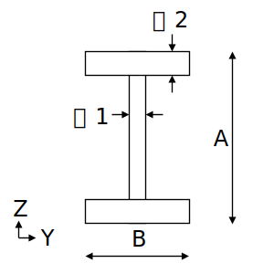

# タイトルです

## 小見出し

* リスト1
* リスト2
1. 数字リスト1
1. 数字リスト2

> 引用
>
> 引用

*強調*や**さらに強調**

```python
print("ソースコード")
```

| header|header|
|:--|--:|
|テーブル1|テーブル2|

数式

$$e^{i\pi}=-1$$

インライン数式$e^{i\pi}=-1$もできるかな

ハイパーリンク

 [STF.secBuildBox関数](st_func_addin/functions/sec_build_box.md)

画像

