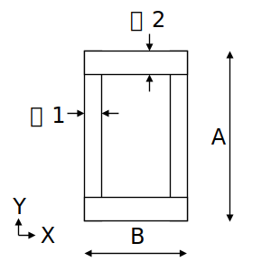

# STF.secBuildBox関数

たとえば、組立角形鋼管（ビルドBOX）の断面算定をするとします。断面積などの断面性能を求めるにはSTF.secBuildBox関数を使用します。

## 説明

組立角形鋼管の断面性能を返します。

断面性能はpropertyTypeの指定により、下記を返します。

|peopertyType|返り値|
|:--:|:--|
|A|断面積(mm $^2$ )|
|ix|X軸回りの断面二次半径(mm)|
|iy|Y軸回りの断面二次半径(mm)|
|Ix|X軸まわりの断面二次モーメント(mm $^4$)|
|Iy|Y軸まわりの断面二次モーメント(mm $^4$)|
|m|単位質量(kg/m)|
|Zx|X軸回りの断面係数(mm $^3$)|
|Zy|Y軸回りの断面係数(mm $^3$)|

## 書式

STF.secBuildBox(propertyType, a, b, t1, t2)

STF.secBuildBox関数の書式には、次の引数があります。

* **propertyType** 必ず指定します。計算する断面性能を文字列で指定します。
* **a** 必ず指定します。成 $A$ (mm)を指定します。
* **b** 必ず指定します。幅 $B$ (mm)を指定します。
* **t1** 必ず指定します。成方向の板厚 $t_1$ (mm)を指定します。
* **t2** 必ず指定します。幅方向の板厚 $t_2$ (mm)を指定します。

## 解説

下記計算式に基づき断面性能を計算します。

計算根拠：建築構造ポケットブックpp.33-34

### A：断面積

$$ A_{断面積}=B\cdot A_{成}-(B-2\cdot t_1)\cdot(A_{成}-2\cdot t_2) $$

### Ix：X軸まわりの断面二次モーメント

$$ Ix=\frac{1}{12}\cdot \{B\cdot A^3-(B-2\cdot t_1)\cdot (A-2\cdot t_2)^3\} $$

### ix：X軸まわりの断面二次半径

$$ ix=\sqrt{\frac{Ix}{A}} $$

### ZX：X軸まわりの断面係数

$$ Zx=\frac{1}{6A}\cdot\{B\cdot A^3-(B-2\cdot t_1)\cdot (A-2\cdot t_2)^3\} $$

### Iy、iy、Zy：Y軸まわりの断面二次モーメント、断面二次半径、断面係数

$A-B、t_1-t_2$を入れ替えて計算。

### m：単位質量

$$m=断面積\times 鉄骨密度\times 単位変換係数$$

鉄骨密度は7850kg/m $^3$

## 使用例
|数式|説明|結果|
|:--|:--|:--|
|=STF.secBuildBox("A",1000,800,19,25)|BB-1000x800x19x25の断面積を求めます。|76100|
|=STF.secBuildBox("Ix",1000,800,19,25)|BB-1000x800x19x25のX軸まわりの断面二次モーメントを求めます。|1.222E+10|
|=STF.secBuildBox("Iy",1000,800,19,25)|BB-1000x800x19x25のY軸まわりの断面二次モーメントを求めます。|7.639E+09|
|=STF.secBuildBox("m",1000,800,19,25)|BB-1000x800x19x25の単位質量を求めます。|597.4|
|=STF.secBuildBox("Zx",1000,800,19,25)|BB-1000x800x19x25のX軸まわりの断面係数を求めます。|2.445E+07|
|=STF.secBuildBox("Zy",1000,800,19,25)|BB-1000x800x19x25のY軸まわりの断面係数を求めます。|1.910E+07|
|=STF.secBuildBox("ix",1000,800,19,25)|BB-1000x800x19x25のX軸まわりの断面二次半径を求めます。|400.8|
|=STF.secBuildBox("iy",1000,800,19,25)|BB-1000x800x19x25のY軸まわりの断面二次半径を求めます。|316.8|
