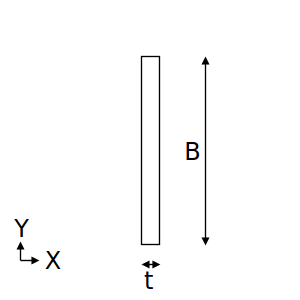

# STF.secFlatBar関数

たとえば、平鋼（フラットバー）の断面算定をするとします。断面積などの断面性能を求めるにはSTF.secFlatBar関数を使用します。

## 説明

平鋼の断面性能を返します。

断面性能はpropertyTypeの指定により、下記を返します。

|peopertyType|返り値|
|:--:|:--|
|A|断面積(mm $^2$ )|
|iY|Y軸回りの断面二次半径(mm)|
|iZ|Z軸回りの断面二次半径(mm)|
|IY|Y軸まわりの断面二次モーメント(mm $^4$)|
|IZ|Z軸まわりの断面二次モーメント(mm $^4$)|
|m|単位質量(kg/m)|
|ZY|Y軸回りの断面係数(mm $^3$)|
|ZZ|Z軸回りの断面係数(mm $^3$)|

## 書式

STF.secFlatBar(propertyType, b, t)

STF.secFlatBar関数の書式には、次の引数があります。

* **propertyType** 必ず指定します。計算する断面性能を文字列で指定します。
* **b** 必ず指定します。幅 $B$ (mm)を指定します。
* **t** 必ず指定します。板厚 $t$ (mm)を指定します。

## 解説

下記計算式に基づき断面性能を計算します。

平鋼の鉄骨断面の基準方向（Z方向）は「幅」方向です。

計算根拠：建築構造ポケットブックpp.33-34

### A：断面積

$$ A= t\cdot B$$

### IY：Y軸まわりの断面二次モーメント

$$ IY=\frac{tB^3}{12} $$

### iY：Y軸まわりの断面二次半径

$$ iY=\sqrt{\frac{IY}{A}} $$

### ZY：Y軸まわりの断面係数

$$ ZY=\frac{tB^2}{6} $$

### IZ、iZ、ZZ：Z軸まわりの断面二次モーメント、断面二次半径、断面係数

$B$と$t$を入れ替えて算出。

### m：単位質量

$$m=断面積\times 鉄骨密度\times 単位変換係数$$

鉄骨密度は7850kg/m $^3$

## 使用例
|数式|説明|結果|
|:--|:--|:--|
|=STF.secFlatBar("A",100,19)|FB-100x19の断面積を求めます。|1900|
|=STF.secFlatBar("IY",100,19)|FB-100x19のY軸まわりの断面二次モーメントを求めます。|1.583E+06|
|=STF.secFlatBar("IZ",100,19)|FB-100x19のZ軸まわりの断面二次モーメントを求めます。|57158|
|=STF.secFlatBar("m",100,19)|FB-100x19の単位質量を求めます。|14.92|
|=STF.secFlatBar("ZY",100,19)|FB-100x19のY軸まわりの断面係数を求めます。|31667|
|=STF.secFlatBar("ZZ",100,19)|FB-100x19のZ軸まわりの断面係数を求めます。|6017|
|=STF.secFlatBar("iY",100,19)|FB-100x19のY軸まわりの断面二次半径を求めます。|28.87|
|=STF.secFlatBar("iZ",100,19)|FB-100x19のZ軸まわりの断面二次半径を求めます。|5.485|
