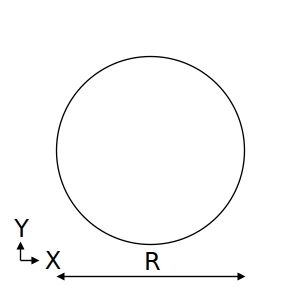

# STF.secRoundBar関数

たとえば、丸鋼の断面算定をするとします。断面積などの断面性能を求めるにはSTF.secRoundBar関数を使用します。

## 説明

丸鋼の断面性能を返します。

断面性能はpropertyTypeの指定により、下記を返します。

|peopertyType|返り値|
|:--:|:--|
|A|断面積(mm $^2$ )|
|ix|X軸回りの断面二次半径(mm)|
|iy|Y軸回りの断面二次半径(mm)|
|Ix|X軸まわりの断面二次モーメント(mm $^4$)|
|Iy|Y軸まわりの断面二次モーメント(mm $^4$)|
|m|単位質量(kg/m)|
|Zx|X軸回りの断面係数(mm $^3$)|
|Zy|Y軸回りの断面係数(mm $^3$)|

## 書式

STF.secRoundBar(propertyType, r)

STF.secRoundBar関数の書式には、次の引数があります。

* **propertyType** 必ず指定します。計算する断面性能を文字列で指定します。
* **r** 必ず指定します。直径 $R$ (mm)を指定します。

## 解説

下記計算式に基づき断面性能を計算します。

計算根拠：建築構造ポケットブックpp.33-34

### A：断面積

$$ A=\frac{\pi R^2}{4} $$

### Ix：X軸まわりの断面二次モーメント

$$ Ix=\frac{\pi R^4}{64} $$

### ix：X軸まわりの断面二次半径

$$ ix=\sqrt{\frac{Ix}{A}} $$

### Zx：X軸まわりの断面係数

$$ Zx=\frac{\pi R^3}{32} $$

### Iy、iy、Zy：Y軸まわりの断面二次モーメント、断面二次半径、断面係数

対称断面のためIy、iy、Zyと同じ。

### m：単位質量

$$m=断面積\times 鉄骨密度\times 単位変換係数$$

鉄骨密度は7850kg/m $^3$

## 使用例
|数式|説明|結果|
|:--|:--|:--|
|=STF.secRoundBar("A",32)|RB-32の断面積を求めます。|804.2|
|=STF.secRoundBar("Ix",32)|RB-32のX軸まわりの断面二次モーメントを求めます。|5.147E+04|
|=STF.secRoundBar("Iy",32)|RB-32のY軸まわりの断面二次モーメントを求めます。|5.147E+04|
|=STF.secRoundBar("m",32)|RB-32の単位質量を求めます。|6.313|
|=STF.secRoundBar("Zx",32)|RB-32のX軸まわりの断面係数を求めます。|3217|
|=STF.secRoundBar("Zy",32)|RB-32のY軸まわりの断面係数を求めます。|3217|
|=STF.secRoundBar("ix",32)|RB-32のX軸まわりの断面二次半径を求めます。|8|
|=STF.secRoundBar("iy",32)|RB-32のY軸まわりの断面二次半径を求めます。|8|
