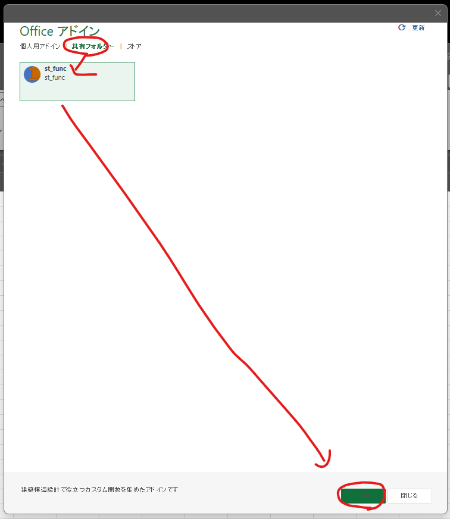

# st_func_addinのインストール方法(デスクトップ)

st-func_addinをデスクトップ版のExcelにインストールする方法です

## マニフェストファイルのダウンロード

ホームページから最新のマニフェストファイル[manifest.xml](https://st-func.main.jp/st-func-addin/manifest.xml)をダウンロードします。

## 共有フォルダの準備

NAS等のネットワーク上のフォルダにアドインを設置する共有フォルダを用意します。ネットワーク上の場所がない場合は、ローカルPCで適当なフォルダを作成し、フォルダのプロパティからフォルダの共有を行い、共有フォルダを作成します。

## マニフェストファイルの設置

先ほどダウンロードしたマニフェストファイルを共有フォルダ上にコピーします。

## Excelの設定

Excelを起動し、「ファイル」→「オプション」→「トラストセンター」→「トラストセンターの設定」を開きます。

「信頼できるアドインカタログ」を選び、先ほど作った共有フォルダのパス（\\\\で始まるパス）を「カタログのURL」のところに入力し、「カタログの追加」をクリックします。

「メニューに表示する」にチェックをつけて「OK」をクリックします。

Excelでブックを開き、「ホーム」タブ→「アドイン」→「+その他のアドイン」をクリックします。

「共有フォルダー」をクリックすると「st_func」が表示されえているので、選択して「追加」をクリックします。

## インストール完了の確認

アドインの読み込みが完了すると、ホームタブに「st_funcについて」というアイコンが表示されます。

カスタム関数が動くかどうかの確認をします。例えばセルに「=STF.secFlatBar("A",100,10)」と入力して、1000が表示されればインストール成功です。

## キャッシュのクリア

アドインが更新された場合はアプリのキャッシュをクリアする必要があります。キャッシュをクリアするには、インストール時と同様に「信頼できるアドインカタログ」を開き、「次回Officeを起動するときに、以前に起動したすべてのWebアドインキャッシュをクリアします」にチェックを入れて「OK」をクリックし、Excelを再起動することで、アドインファイルが読み込みなおされます。

## アンインストール

インストール時と同様に「信頼できるアドインカタログ」を開き、設定した共有フォルダをクリックして「削除」をクリックし「OK」とすることでアンインストールされます。

