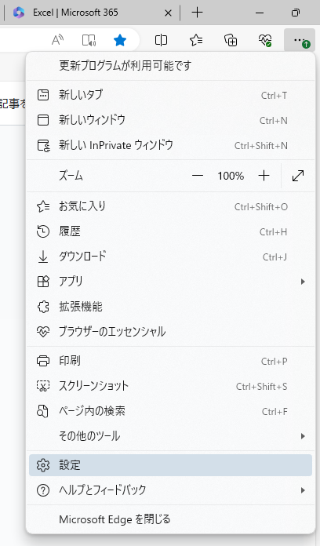

# st_func_addinのインストール方法(WEB)

st-func_addinをExcel Onlineにインストールする方法です

## マニフェストファイルのダウンロード
ホームページから最新のマニフェストファイル[manifest.xml](https://st-func.main.jp/st-func-addin/manifest.xml)をダウンロードします。

## Excel Onlineを開く

Excel Onlineを開き、新規（または既存）のbookを開きます。

## マニフェストファイルの登録

リボンのホームタブの「アドイン」→「+その他のアドイン」をクリックします。

Officeアドインのダイアログが開くので、「個人用アドイン」→「マイアドインのアップロード」とクリックします。

「参照」で先ほどダウンロードしたmanifest.xmlを選び、「アップロード」をクリックします。

## インストール完了の確認

アドインの読み込みが完了すると、ホームタブに「st_funcについて」というアイコンが表示されます。

カスタム関数が動くかどうかの確認をします。例えばセルに「=STF.secFlatBar("A",100,10)」と入力して、1000が表示されればインストール成功です。

## アンインストール方法

Edgeの「・・・」メニューから「設定」を開きます。

左上の検索ボックスに「キャッシュ」と入力し、出てきた今すぐ閲覧データをクリアの項目にある「クリアするデータの選択」をクリックする。

「Cookieおよびその他のサイトデータ」にチェックを入れる。「時間の範囲」については、アドインをインストールした期間が含むように選択する。不明の場合は「全ての期間」を選べばよい。最後に「今すぐクリア」をクリックする。

以上でアンインストールが完了します。Excelを起動して「st_funcについて」というアイコンが消えていることを確認してください。

※アドインとは関係ないCookieも消えてしまうため、ご了承ください。