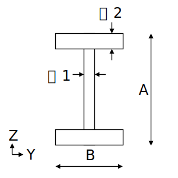

# STF.secBuildH関数

たとえば、組立H形鋼（ビルドH）の断面算定をするとします。断面積などの断面性能を求めるにはSTF.secBuildH関数を使用します。

## 説明

組立H形鋼の断面性能を返します。

断面性能はpropertyTypeの指定により、下記を返します。

|peopertyType|返り値|
|:--:|:--|
|A|断面積(mm $^2$ )|
|IY|Y軸まわりの断面二次モーメント(mm $^4$)|
|IZ|Z軸まわりの断面二次モーメント(mm $^4$)|
|m|単位質量(kg/m)|

## 書式

STF.secBuildH(propertyType, a, b, t1, t2)

STF.secBuildH関数の書式には、次の引数があります。

* **propertyType** 必ず指定します。計算する断面性能を文字列で指定します。
* **a** 必ず指定します。成 $A$ (mm)を指定します。
* **b** 必ず指定します。フランジ幅 $B$ (mm)を指定します。
* **t1** 必ず指定します。ウェブ厚 $t_1$ (mm)を指定します。
* **t2** 必ず指定します。フランジ厚 $t_2$ (mm)を指定します。

## 解説

下記計算式に基づき断面性能を計算します。

### A：断面積

$$ 断面積=A\cdot B-(A-2\cdot t_2)\cdot (B-t_1) $$

### IY：Y軸まわりの断面二次モーメント

$$ IY=(B\cdot A^3-(B-t_1)\cdot (A-2\cdot t_2)^3)/12 $$

### IZ：Z軸まわりの断面二次モーメント

$$ IZ=(t_2\cdot 2\cdot B^3+(A-2\cdot t_2)\cdot t_1^3)/12 $$

### m：単位質量

$$m=断面積\times 鉄骨密度\times 単位変換係数$$

鉄骨密度は7850kg/m $^3$

## 使用例
|数式|説明|結果|
|:--|:--|:--|
|=STF.secBuildH("A",1200,400,19,25)|BH-1200x400x19x25の断面積を求めます。|41850|
|=STF.secBuildH("IY",1200,400,19,25)|BH-1200x400x19x25のY軸まわりの断面二次モーメントを求めます。|9.312E+09|
|=STF.secBuildH("IZ",1200,400,19,25)|BH-1200x400x19x25のZ軸まわりの断面二次モーメントを求めます。|2.673E+08|
|=STF.secBuildH("m",1200,400,19,25)|BH-1200x400x19x25の単位質量を求めます。|328.5225|
