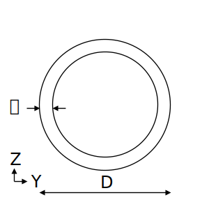

# STF.secPipe関数

たとえば、円形鋼管（パイプ）の断面算定をするとします。断面積などの断面性能を求めるにはSTF.secPipe関数を使用します。

## 説明

円形鋼管の断面性能を返します。

断面性能はpropertyTypeの指定により、下記を返します。

|peopertyType|返り値|
|:--:|:--|
|A|断面積(mm $^2$ )|
|iY|Y軸回りの断面二次半径(mm)|
|iZ|Z軸回りの断面二次半径(mm)|
|IY|Y軸まわりの断面二次モーメント(mm $^4$)|
|IZ|Z軸まわりの断面二次モーメント(mm $^4$)|
|m|単位質量(kg/m)|
|ZY|Y軸回りの断面係数(mm $^3$)|
|ZZ|Z軸回りの断面係数(mm $^3$)|

## 書式

STF.secPipe(propertyType, d, t)

STF.secPipe関数の書式には、次の引数があります。

* **propertyType** 必ず指定します。計算する断面性能を文字列で指定します。
* **d** 必ず指定します。直径 $D$ (mm)を指定します。
* **t** 必ず指定します。板厚 $t$ (mm)を指定します。

## 解説

下記計算式に基づき断面性能を計算します。

計算根拠：建築構造ポケットブックpp.33,35

### A：断面積

$$ A=\frac{\pi}{4}\{D^2-(D-2t)^2\} $$

### IY：Y軸まわりの断面二次モーメント

$$ IY=\frac{\pi}{64}\{D^4-(D-2t)^4\} $$

### iY：Y軸まわりの断面二次半径

$$ iY=\sqrt{\frac{IY}{A}} $$

### ZY：Y軸まわりの断面係数

$$ ZY=\frac{\pi}{32}\frac{D^4-(D-2t)^4}{D} $$

### IZ、iZ、ZZ：Z軸まわりの断面二次モーメント、断面二次半径、断面係数

対称断面のためIY、iY、ZYと同じ。

### m：単位質量

$$m=断面積\times 鉄骨密度\times 単位変換係数$$

鉄骨密度は7850kg/m $^3$

## 使用例
|数式|説明|結果|
|:--|:--|:--|
|=STF.secPipe("A",508,9)|P-508x9の断面積を求めます。|14108|
|=STF.secPipe("IY",508,9)|P-508x9のY軸まわりの断面二次モーメントを求めます。|4.393E+08|
|=STF.secPipe("IZ",508,9)|P-508x9のZ軸まわりの断面二次モーメントを求めます。|4.393E+08|
|=STF.secPipe("m",508,9)|P-508x9の単位質量を求めます。|110.8|
|=STF.secPipe("ZY",508,9)|P-508x9のY軸まわりの断面係数を求めます。|1.729E+06|
|=STF.secPipe("ZZ",508,9)|P-508x9のZ軸まわりの断面係数を求めます。|1.729E+06|
|=STF.secPipe("iY",508,9)|P-508x9のY軸まわりの断面二次半径を求めます。|176.5|
|=STF.secPipe("iZ",508,9)|P-508x9のZ軸まわりの断面二次半径を求めます。|176.5|
